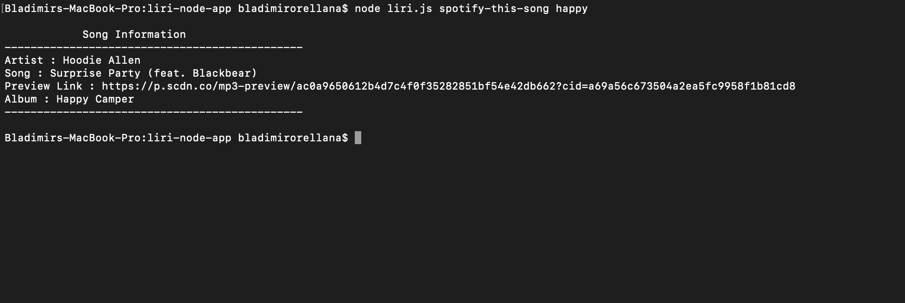

# App Information
### App Name
- liri
### CATEGORY
- Utility

### AUTHOR
#### [Bladimir Orellana](https://bladimirorellana.com)

## Short Descriction

Liri is a comand line  search app for **Concerts** :microphone:, **Movies** :movie_camera:, and  **Songs** :musical_note: 

# FEATURES
#### **Concerts** :microphone:
#### **Movies** :movie_camera:
#### **Songs** :musical_note:

## How to use it!

`Liri` needs two arguments so it can work
The first argument is the `Search type` and the second one is the `Query`

#### Example 

- `$ node liri.js spotify-this-song [Artists-name]`
- `$ node liri.js movie-this [Movie-name]`
- `$ node liri.js concert-this [Singer-name]`
- `$ node liri.js do-what-it-says [This comand dont need a query]`

## Let's search for a song on SPOTIFY
### We type...

`$ node liri.js spotify-this-song [Artists-name]`

### We get the search result

